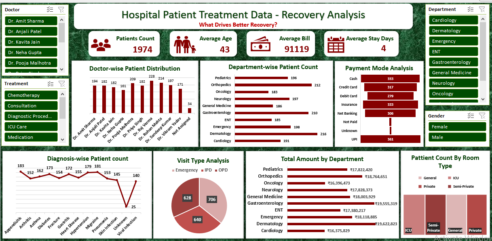

# 🏥 Hospital Dashboard - Excel Project
**By Ritu | Aspiring Data Analyst**

## 📌 Project Overview
This is an end-to-end Hospital Dashboard project built entirely in Microsoft Excel. It demonstrates my skills in Data Cleaning, Data Modeling (Pivot), and Dashboard Visualization.

The goal was to convert raw hospital data into a meaningful dashboard for better operational and financial decisions.

## 📂 What's Inside the Workbook
The workbook `Hospital_Dashboard.xlsx` contains 6 well-managed sheets:

1.  **START HERE (Cover):** Project introduction and navigation
2.  **Raw Hospital Data:** Original dataset
3.  **Cleaned Data:** Cleaned and standardized data using Power Query
4.  **Field Guide:** Data Dictionary with column definitions
5.  **Pivot Table:** Backend calculations for charts
6.  **Dashboard:** Final interactive dashboard

## 🛠️ Skills Demonstrated
- Data Cleaning & Transformation
- Pivot Tables & Charts
- Interactive Slicers
- Advanced Excel Functions 
- Dashboard Design & Storytelling

## 📈 Dashboard Preview

## 🔍 Key Insights from Dashboard
- Top revenue-generating department identified.
- Patient visit trend analyzed month-wise.
- Average billing and patient count tracked.
- OPD vs IPD performance comparison.

## 🚀 How to View
1. Download `Hospital_Dashboard.xlsx`
2. Enable Editing
3. Go to the Dashboard sheet and use Slicers to interact

Thanks for checking out my project!
